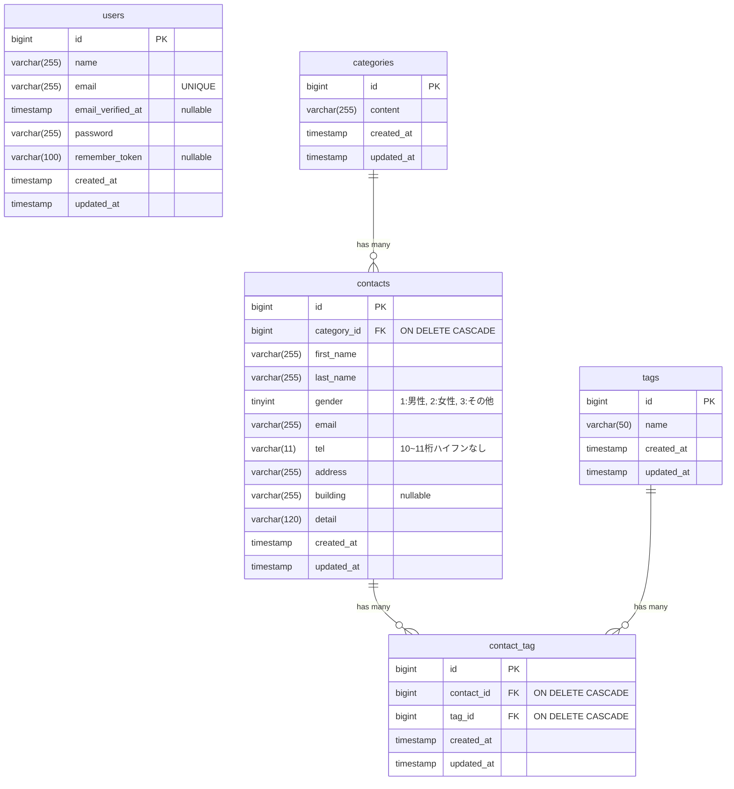

# [CT] お問い合わせフォーム

## 概要
本プロジェクトは、お問い合わせ情報を管理するためのアプリケーションです。一般ユーザーからのお問い合わせフォームと、管理者向けの管理画面を提供します。
管理画面からは、お問い合わせの検索機能付きの一覧表示や編集・削除等を行うことができます。

また、公開APIも提供しているため,外部システムからのお問い合わせ投稿のほか、バックエンドでのCRUD操作を行うことができます。

## ER図

※ `contact_tag`テーブルは複合制約`UNIQUE(contact_id, tag_id)`が付きます

## 環境構築手順
本プロジェクトは Laravel Sail を利用して構築されています。
1. リポジトリのクローン
```
git clone https://github.com/rnapyzz/contact-form-app.git
cd contact-form-app
```

2. 環境変数の設定
```
cp .env.example .env
```
※ テストのカバレッジを計測したい場合は、`.env`の`XDEBUG_MODE`を`coverage`に変更して実行ください。

3. Laravel Sailのインストール
```
docker run --rm \
    -u "$(id -u):$(id -g)" \
    -v "$(pwd):/var/www/html" \
    -w /var/www/html \
    -e COMPOSER_CACHE_DIR=/tmp/composer_cache \
    laravelsail/php82-composer:latest \
    composer require laravel/sail --dev
```

4. Sailの設定ファイルをパブリッシュ
```
docker run --rm \
    -u "$(id -u):$(id -g)" \
    -v "$(pwd):/var/www/html" \
    -w /var/www/html \
    -e COMPOSER_CACHE_DIR=/tmp/composer_cache \
    laravelsail/php82-composer:latest \
    php artisan sail:install --with=mysql
```

5. Dockerコンテナの起動
```
./vendor/bin/sail up -d
```

6. フロントエンドの起動
```
./vendor/bin/sail npm install
./vendor/bin/sail npm run dev
```

7. アプリケーションキーの生成
```
./vendor/bin/sail artisan key:generate
```

8. マイグレーションの実行（初期データの投入）
```
./vendor/bin/sail artisan migrate --seed
```
既存のデータベースをリセットして再マイグレーションしたい場合は、<br>
`./vendor/bin/sail artisan migrate:fresh --seed` で実行してください。　


## テストの実行方法
* 全テストの実行
```
./vendor/bin/sail test
```
* カバレッジの計測
```
./vendor/bin/sail test --coverage
```
※ テストのカバレッジを計測したい場合は、`.env`の`XDEBUG_MODE`を`coverage`に変更して実行ください。

## 使用技術
- Backend: PHP 8.2, Laravel 10.x
- Frontend: Vite, TailwindCSS ^3.4.0
- Web Server: Nginx
- Database: MySQL 8.0
- Tools:
  - Docker (Laravel Sail)
  - phpMyAdmin

## APIエンドポイント一覧
| メソッド   | URI                          | 概要                             | 認証 |
|:-------|:-----------------------------|:-------------------------------|:---|
| GET    | `/api/v1/contacts`           | お問い合わせ一覧取得<br/>（検索・ページネーション付き） | 不要 |
| GET    | `/api/v1/contacts/{contact}` | お問い合わせ詳細取得<br/>（カテゴリ・タグ含む）     | 不要 |
| POST   | `/api/v1/contacts`           | お問い合わせ新規作成                     | 不要 |
| PUT    | `/api/v1/contacts/{contact}` | お問い合わせ詳細更新                     | 不要 |
| DELETE | `/api/v1/contacts/{contact}` | お問い合わせ詳細削除                     | 不要 |

[注意事項] すべてのリクエストにおいて、ヘッダーに `Accept: application/json` を含めてください。

## 開発環境URL
一般ユーザー: `http://localhost`

管理者向け　: `http://localhost/admin` <br>

## 作成者
Kosei.T
