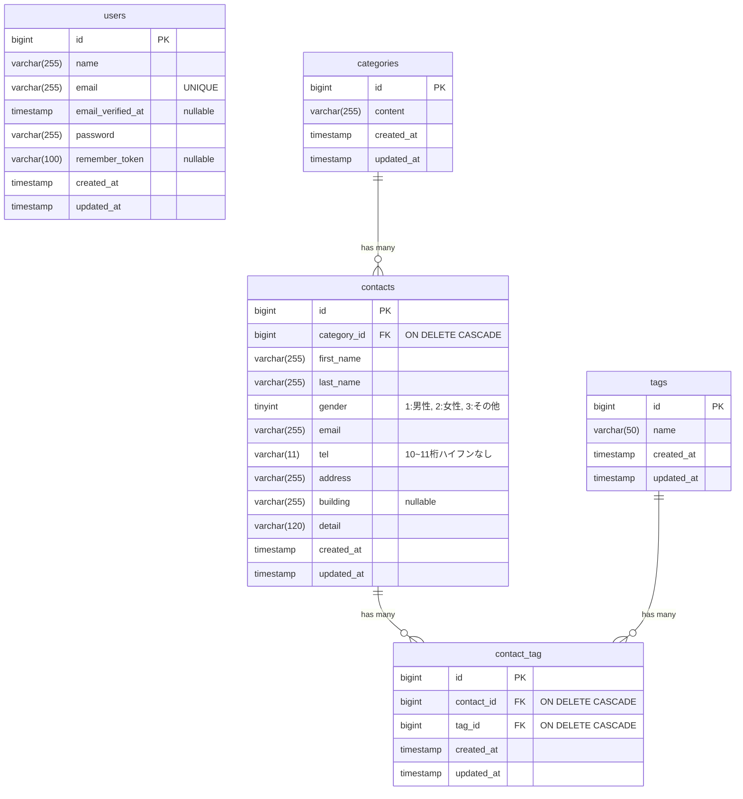

# [CT] お問い合わせフォーム

## 概要

## ER図

※ `contact_tag`テーブルは複合制約`UNIQUE(contact_id, tag_id)`が付きます

## 環境構築手順

## 使用技術

## APIエンドポイント一覧
| メソッド   | URI                          | 概要                             | 認証 |
|:-------|:-----------------------------|:-------------------------------|:---|
| GET    | `/api/v1/contacts`           | お問い合わせ一覧取得 （検索・ページネーション付き） | 不要 |
| GET    | `/api/v1/contacts/{contact}` | お問い合わせ詳細取得 （カテゴリ・タグ含む）     | 不要 |
| POST   | `/api/v1/contacts`           | お問い合わせ新規作成                     | 不要 |
| PUT    | `/api/v1/contacts/{contact}` | お問い合わせ詳細更新                     | 不要 |
| DELETE | `/api/v1/contacts/{contact}` | お問い合わせ詳細削除                     | 不要 |
[注意事項] すべてのリクエストにおいて、ヘッダーに `Accept: application/json` を含めてください。

## 開発環境URL
`http://localhost:80`

## 作成者
